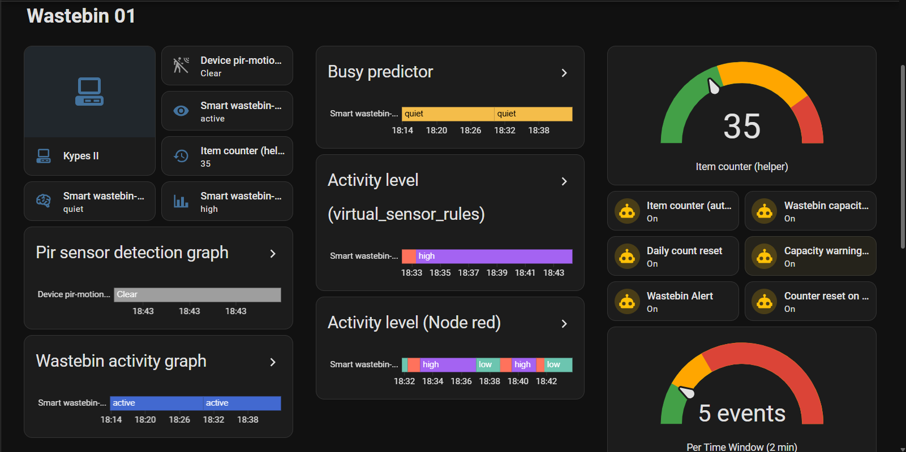
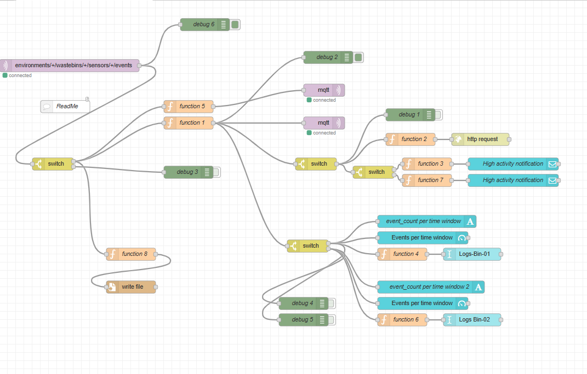
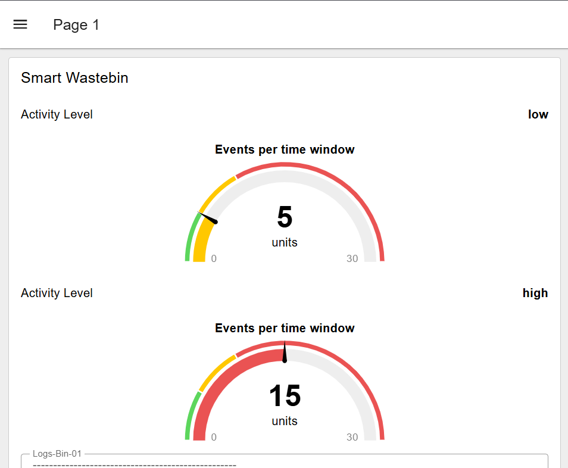
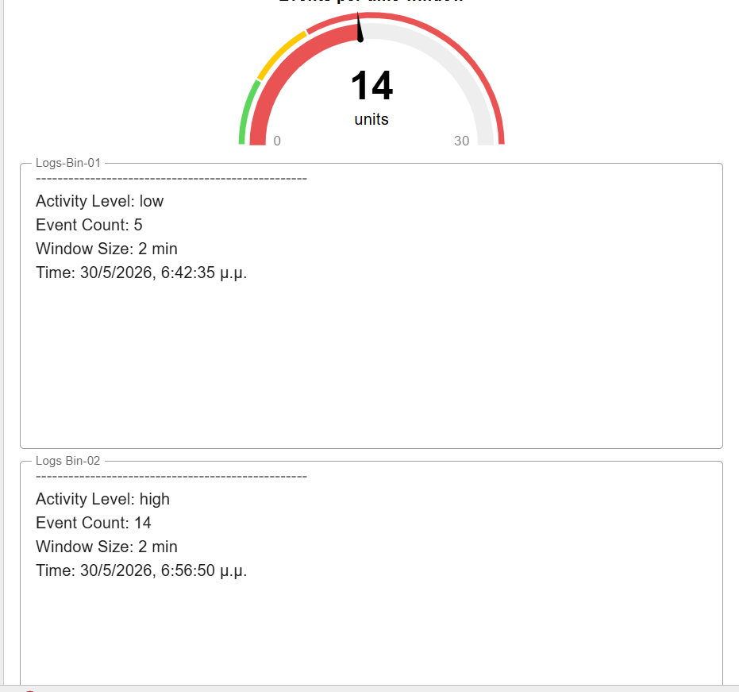
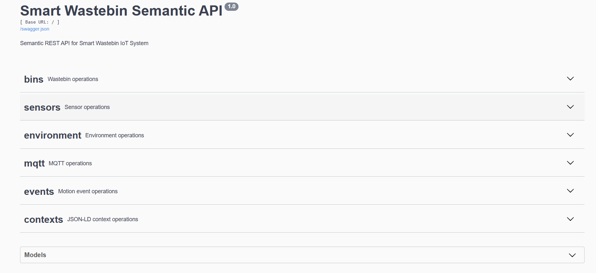
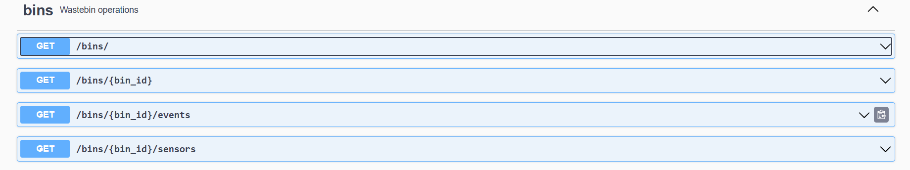

# Smart Waste bin project

A full-stack IoT pipeline that uses a Raspberry Pi 5 and a PIR motion sensor to create a smart waste bin system. The sensor detects motion inside the bin, streams events over MQTT, exposes them through a semantic REST API and visualizes them on a Home Assistant dashboard, all containerized with Docker Compose.

### Advanced Programming Techniques - Team 6 - Final Project

### Team Information

Members:

- Marios Ioannis Papadopoulos 1092834  
- Filippos Neofytos Theologos 1092633  
- Xristina Tzouda 1097346

---

# RUNBOOK

## Repository Structure

```
smart-waste-bin/
├── api.py                      # Flask REST API with Swagger UI
├── producer.py                 # MQTT publisher — reads PIR sensor
├── consumer.py                 # MQTT subscriber — writes events.jsonl
├── analyze.py                  # Seaborn analytics script
├── asyncapi.yaml               # AsyncAPI specification for MQTT interface
├── train_model.py              # ML model training script
├── virtual_sensor_ml.py        # ML-based virtual sensor
├── virtual_sensor_rules.py     # Rule-based virtual sensor
├── requirements.txt            # Python dependencies
├── Dockerfile                  # Container image definition
├── docker-compose.yml          # Multi-service orchestration
├── .dockerignore
├── .gitignore
├── data/
│   ├── charts/                 # Generated Seaborn charts
│   ├── consumer/               # Consumer event logs (events.jsonl)
│   ├── homeassistant/          # Home Assistant data
│   └── nodered/                # Node-RED event logs
├── models/                     # JSON-LD semantic models
│   ├── context.jsonld
│   ├── wastebin.jsonld
│   ├── sensor.jsonld
│   ├── environment.jsonld
│   └── busy_predictor.joblib   # Trained ML model
├── pirlib/                     # PIR sensor library
│   ├── sampler.py
│   └── interpreter.py
└── docs/
    └── ontology.md             # Semantic models and ontology documentation
```

## Architecture Overview

```

                         +---------------------------+
                         |      Raspberry Pi 5       |
                         |  HC-SR501 · producer.py   |
                         +-------------+-------------+
                                       |
                                  MQTT QoS 1
                                       |
                         +-------------+-------------+
                         |      Mosquitto Broker      |
                         |     Docker · port 1883     |
                         +--+------+--------+------+--+
                            |      |        |      |
              ┌─────────────┘      |        |      └─────────────┐
              |                    |        |                     |
              v                    v        v                     v
  +--------------+    +----------+  +---------------+  +------------------+
  | consumer.py  |    | Node-RED |  |Virtual sensors|  | Home Assistant   |
  | events.jsonl |    | port 1881|  | rules · ML    |  | port 8124        |
  +--------------+    +----+-----+  +-------+-------+  +------------------+
         |                 |                |
         |            republish         publish
         |            alerts            predictions
         |                 \                /
         |                  v              v
         |               +-----+----+--------+
         |               |  Mosquitto Broker  |
         |               +-------------------+
         v
  +------------+      +------------------+
  | Flask API  |      |    Analytics     |
  | port 5001  |  +   |  analyze.py      |
  +------------+      +------------------+

  +------------------------------------------+
  | Simulated producers (wastebin-02, 03, 04) |
  +------------------------------------------+
```

- `producer.py`: Runs on the Raspberry Pi, reads the PIR sensor, and publishes motion events to the MQTT broker.
- `consumer.py`: Subscribes to the MQTT topic, processes incoming events, and saves them to `events.jsonl`.
- `api.py`: A Flask REST API that serves the collected events from the consumer and provides endpoints with full Swagger documentation.
- `Node-RED`: Acts as a stream-processing layer that performs logic such as event aggregation, threshold detection, and alert generation.
- `Home Assistant`: Provides real-time visualization, dashboards, and notifications based on processed and real - time incoming events.

## Necessary Hardware

- Raspberry pi 5
- HC-SR501 PIR motion sensor
- Jumper wires (female to female)

## Wiring Diagram

```
PIR Sensor        Raspberry Pi
-----------       -------------
VCC  -----------> 5V
GND  -----------> GND
OUT  -----------> GPIO17
```

- In this project it was used :
- Physical pin 2 for VCC (5V)
- Physical pin 6 for GND (Ground)
- Physical pin 11 for OUT (GPIO17)

* If the user wants to use different GPIO pin for the OUT connection, they need to change the `--pin` argument in the `docker-compose.yml` file.

## Software Setup

The laptop or computer that is used to connect to the Raspberry Pi must have python 3.12 or higher installed in order for all the scripts to work. The Raspberry Pi must have python 3.12 or higher installed as well.

## Step 1: Connect to the Raspberry Pi

1. Enable ssh on the Raspberry Pi. On a terminal on the Raspberry run :

```
sudo raspi-config
```

Then navigate to `Interface Options` -> `SSH` -> `Enable` and exit the configuration tool.

2. Verify ssh works. On a terminal on the Raspberry run :

```
systemctl status ssh
```

Result should be **active (running)**.

3. Connect to Raspberry Pi by using SSH. In order to do that a user must do wifi hotspot to the Raspberry Pi from their laptop or computer. From the terminal of your computer run the following command:

```
ssh hostname@<Raspberry_Pi_IP_ADDRESS>
```

In order to find the IP address and the hostname of the Raspberry Pi, you can run the following commands on the Raspberry Pi terminal:

```
hostname
ip a
```

- The hostname is the name of the Raspberry Pi and is used in the ssh command. 
- The IP address should be in the form of `192.168.x.x` and is the ip address of the laptop that is doing hotspot to the Raspberry Pi.

4. It requires the password of the Raspberry Pi user,by default. 
The default username is `pi` and the default password is `raspberry`. If changed put the new ones.
5. In order to verify that the connection was successful, run the following command on the laptop connected to the Raspberry Pi terminal:

```
whoami
```
The result should be the same as the username of the Raspberry Pi user(the one used on the ssh command).

## Step 2: Clone the repository

On the laptop connected to the Raspberry pi, open a terminal and run the following command:

```
git clone https://github.com/johnmarios/smart-waste-bin.git
```

This will clone the repository to the raspberry pi. Then navigate to the cloned repository:

```
cd smart-waste-bin
```

## Step 3: Create a Python virtual environment

On the computer connected to the Raspberry Pi terminal, run the following command to create a Python virtual environment:

```
python3 -m venv venv
```

Then activate the virtual environment by running the following command:

```
source venv/bin/activate
```

After activation the terminal prompt should show (venv) at the beginning.

## Step 4: Install the required Python packages

Make sure you are in the virtual environment and run the following command to install the required Python packages:

```
pip install -r requirements.txt
```

This will install all the required packages for the project.

- The needed packages are:
  - Hardware: gpiozero, rpi-lgpio — GPIO control for the PIR sensor
  - MQTT: paho-mqtt — MQTT client for publishing and subscribing
  - API: flask, flask-restx — REST API framework with Swagger UI
  - ML: numpy, pandas, scikit-learn, joblib — data processing and ML model

## Step 5: Docker installation

- If the docker is installed run  on a terminal on the computer connected to the Raspberry Pi:

```
docker --version
docker compose version
```

- If it is not intalled run :

```
curl -fsSL https://get.docker.com | sh
```

- By default every docker command would need sudo. To fix that, add your user to the docker group:

```
sudo usermod -aG docker $USER
```

- This change only takes effect in new login sessions. To confirm it worked, after logging back in run:

```
groups
```

- Then run :

```
docker run hello-world
```

- If you see a success message, Docker is installed and your user has the correct permissions.

## Step 6: Run the Docker Compose setup

- After installing Docker, you can run the entire application stack using Docker Compose. In the terminal of the computer connected to the Raspberry Pi, navigate to the project directory and run:

```
docker compose up
```

This command will build and start all the services defined in the `docker-compose.yml` file:

- **broker** — Mosquitto MQTT broker
- **api** — Flask REST API on port 5001
- **consumer** — main consumer, writes to `data/consumer/events.jsonl`
- **consumer-slow** — second consumer with delay, writes to `data/consumer-slow/events-slow.jsonl`
- **producer** — reads the physical PIR sensor on GPIO17
- **producer-sim-02** — simulated producer for wastebin-02
- **producer-sim-03** — simulated producer for wastebin-03
- **producer-sim-04** — simulated producer for wastebin-04
- **node-red** — Node-RED on port 1881
- **homeassistant** — Home Assistant on port 8124
- **virtual-sensor-ml-1** — ML virtual sensor for wastebin-01
- **virtual-sensor-ml-2** — ML virtual sensor for wastebin-02
- **virtual-sensor-rules-wastebin-01** — rule-based virtual sensor for wastebin-01
- **virtual-sensor-rules-wastebin-02** — rule-based virtual sensor for wastebin-02
- **analytics** — runs `analyze.py` and generates charts in `data/charts/`

You should see logs from all services in the terminal.

- In case you want to run each script separately you can run the following command:

```
docker compose up --build <service>
```

Where `<service>` can be found in the `docker-compose.yml` file.
For example if you want to run the `producer.py` script , you have to run:

```
docker compose up --build broker producer
```

## Step 7: Access the services

- **Home Assistant** dashboard: `http://<Raspberry_Pi_IP_ADDRESS>:8124`
- **Node-RED** editor: `http://<Raspberry_Pi_IP_ADDRESS>:1881`
- **Node-RED** dashboard: `http://<Raspberry_Pi_IP_ADDRESS>:1881/dashboard`

## Step 8: Access the API

- The API service will be available at `http://<Raspberry_Pi_IP_ADDRESS>:5001` (This is the ip of the laptop  used to connect to the raspberry pi via ssh).
- It provides the following endpoints:
  - Event retrieval endpoints
  - System status endpoint
  - Full Swagger UI documentation

## Example output

Write the following command in order to run the producer and the consumer. In case of a new raspberry pi navigate to your own path:
```
iotlab_upat_6@iotlab-Upat-6:~/team/project/smart-waste-bin $ docker compose up broker consumer producer
```
The terminal should look like this :
```
[+] up 3/5
[+] up 3/5... Created                                                   0.1s
[+] up 3/5... Created                                                   0.1s
[+] up 7/7... Created                                                   0.1s
 ✔ Network... Created                                                   0.1s
 ✔ Contain... Created                                                   0.2s
 ! broker     Your kernel does not support memory limit capabilities or the cgroup is not mounted. Limitation discarded. 0.0s                       0.3s
 ✔ Contain... Created                                                   0.3s
 ✔ Contain... Created                                                   0.3s
 ! producer   Your kernel does not support memory limit capabilities or the cgroup is not mounted. Limitation discarded. 0.0s
 ! consumer   Your kernel does not support memory limit capabilities or the cgroup is not mounted. Limitation discarded. 0.0s
Attaching to iot-broker, iot-consumer, iot-producer
iot-broker  | 1780156974: Info: running mosquitto as user: mosquitto.
iot-broker  | 1780156974: mosquitto version 2.1.2 starting
iot-broker  | 1780156974: Config loaded from /mosquitto/config/mosquitto.conf.
iot-broker  | 1780156974: Bridge support available.
iot-broker  | 1780156974: Persistence support available.
iot-broker  | 1780156974: TLS support available.
iot-broker  | 1780156974: TLS-PSK support available.
iot-broker  | 1780156974: Websockets support available.
iot-broker  | 1780156974: Opening ipv4 listen socket on port 1883.
iot-broker  | 1780156974: Opening ipv6 listen socket on port 1883.
iot-broker  | 1780156974: mosquitto version 2.1.2 running
iot-consumer  | [consumer-storage] broker=broker:1883 topic=environments/+/wastebins/+/sensors/+/# qos=1 duration=3000.0s out=/data/events.jsonl delay=0.0s cache=100
iot-broker    | 1780156975: New connection from 172.21.0.4:38505 on port 1883.
iot-broker    | 1780156975: New client connected from 172.21.0.4:38505 as consumer-main (p4, c0, k60).
iot-consumer  | [consumer] subscribed topic=environments/+/wastebins/+/sensors/+/#
iot-producer  | /usr/local/lib/python3.11/site-packages/gpiozero/devices.py:300: PinFactoryFallback: Falling back from lgpio: 'can not open gpiochip'
iot-producer  |   warnings.warn(
iot-producer  | [producer] broker=broker:1883 topic=environments/environment-01/wastebins/wastebin-01/sensors/pir-motion-sensor-01/events qos=1 device=pir-motion-sensor-01 pin=17 interval=0.2s cooldown=5.0s min_high=0.5s duration=3000.0s seq_start=0
iot-broker    | 1780156975: New connection from 172.21.0.3:33275 on port 1883.
iot-broker    | 1780156975: New client connected from 172.21.0.3:33275 as producer-main (p4, c0, k60).
iot-broker    | 1780156982: New connection from 172.21.0.1:34420 on port 1883.
iot-broker    | 1780156982: New client connected from 172.21.0.1:34420 as 2G2gbRFlEiph8CI059yjps (p4, c1, k60).
iot-broker    | 1780156982: New connection from 172.21.0.1:34434 on port 1883.
iot-broker    | 1780156982: New client connected from 172.21.0.1:34434 as noderedd062cdcc9cb70c3c (p4, c1, k60).
```
After the downloading is over the output is something like this:
```
iot-consumer  | [consumer-storage] wrote seq=0 bin=wastebin-01
iot-producer  | [producer] published seq=0 topic=environments/environment-01/wastebins/wastebin-01/sensors/pir-motion-sensor-01/events state=clear event_time=2026-05-30T16:03:04.706Z
iot-producer  | [producer] published seq=0 topic=environments/environment-01/wastebins/wastebin-01/sensors/pir-motion-sensor-01/events state=clear event_time=2026-05-30T16:03:14.713Z
iot-consumer  | [consumer] duplicate record detected, dropping run_id=ad56d2b9-dfcd-4e8d-99f0-afe613edb445 seq=0
iot-producer  | [producer] published seq=1 topic=environments/environment-01/wastebins/wastebin-01/sensors/pir-motion-sensor-01/events state=detected event_time=2026-05-30T16:03:50.137Z
iot-consumer  | [consumer-storage] wrote seq=1 bin=wastebin-01
iot-producer  | [producer] published seq=1 topic=environments/environment-01/wastebins/wastebin-01/sensors/pir-motion-sensor-01/events state=clear event_time=2026-05-30T16:03:50.338Z
```

## JSON Output

In case of a new raspberry pi navigate to your own path

1. Node-Red output :

- Command:

```
iotlab_upat_6@iotlab-Upat-6:~/team/project/smart-waste-bin/data/nodered/logs $ cat detected_events_wastebin-01_red.jsonl
```

- Result :

```
{"@context":"models/context.jsonld","@type":"sosa:Observation","event_time":"2026-05-30T16:20:27.151Z","device_id":"pir-motion-sensor-01","wastebin_id":"wastebin-01","environment_id":"environment-01","event_type":"motion","motion_state":"detected","seq":1,"run_id":"d249a3ac-6251-48c4-9245-9abe844c61ca","latency_seconds":0.045}
{"@context":"models/context.jsonld","@type":"sosa:Observation","event_time":"2026-05-30T16:20:41.161Z","device_id":"pir-motion-sensor-01","wastebin_id":"wastebin-01","environment_id":"environment-01","event_type":"motion","motion_state":"detected","seq":2,"run_id":"d249a3ac-6251-48c4-9245-9abe844c61ca","latency_seconds":0.047}
```

2. Consumer output:

- Command :

```
iotlab_upat_6@iotlab-Upat-6:~/team/project/smart-waste-bin/data/consumer $ cat events.jsonl
```

- Result:

```
{"@context": "models/context.jsonld", "@type": "sosa:Observation", "event_time": "2026-05-30T16:21:43.951Z", "device_id": "pir-motion-sensor-02", "wastebin_id": "wastebin-02", "environment_id": "environment-01", "event_type": "motion", "motion_state": "detected", "seq": 19, "run_id": "12adea30-4ab2-4139-a357-81b8f1d0548f", "latency_seconds": 0.04312491416931152}
{"@context": "models/context.jsonld", "@type": "sosa:Observation", "event_time": "2026-05-30T16:21:49.155Z", "device_id": "pir-motion-sensor-02", "wastebin_id": "wastebin-02", "environment_id": "environment-01", "event_type": "motion", "motion_state": "detected", "seq": 20, "run_id": "12adea30-4ab2-4139-a357-81b8f1d0548f", "latency_seconds": 0.04292416572570801}
```

## Home Assistant Dashboard



## Node-RED Dashboard and Flows

- Flow:



- Dashboard:



## API screenshot

- Picture of the API:

- Example output from API:

1. Press `GET /bins/`:


2. Output on terminal :

```
 api-project  | 192.168.137.1 - - [30/May/2026 16:13:57] "GET /bins/ HTTP/1.1" 200 -
```

